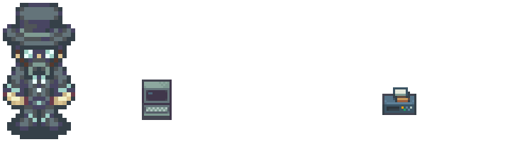

<picture>
  <source media="(prefers-color-scheme: dark)" srcset="assets/zeroculture-profile-banner.png">
  <source media="(prefers-color-scheme: light)" srcset="assets/zeroculture-profile-banner-light.png">
  
</picture>
 
<picture>
  
</picture>
<picture>
  
</picture>
  
Hey there ✌️ I'm Winters and it seems you have stumbled upon my GitHub profile. I'm a hobbyist game dev and occassional modder who enjoys learning everything about game development. Somewhere between discovering RPG Maker 2000 when I was 13 years old and making my own mods for The Elder Scrolls III: Morrowind, I developed a passion for game development. 
  
Over the years I have enjoyed being a part of some great communities for game engines like RPG Maker, Game Maker, Unreal Engine and Unity where I have learned just how accessible game development can be. I've also spent time in the modding communities learning and creating mostly personal mods for games like Morrowind and Oblivion and maps for games like Unreal Tournament.
  
These days I mostly focus on Unity where I am currently working on a game prototype and wait optimistically for Starfield where I am interested in focusing some time modding in the future when it releases. This GitHub profile not only holds my projects but may also hold resources and tools I believe may be useful in the future.
